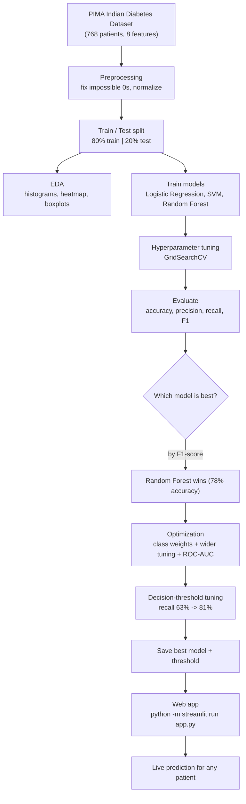

# Diabetes Prediction using Machine Learning

[](https://github.com/sam-black007/diabetes-prediction/actions)

A simple machine learning project that predicts whether a person has diabetes based on their medical records. I used the classic **PIMA Indian Diabetes Dataset**, which has records for 768 patients with 8 health features.

## What I used
Python, Pandas, NumPy, Scikit-Learn, Matplotlib, Seaborn and Streamlit. I trained and compared three models — **Logistic Regression, SVM, and Random Forest** — and picked the best one.

## Project flow



## Step-by-step setup

**Step 1 — Install Python (only if you don't have it)**
- Download from https://www.python.org/downloads/ (choose 3.10 or newer)
- During installation, tick **"Add Python to PATH"** — this is important
- Check it worked. Open a terminal (cmd on Windows / Terminal on Mac) and type:
```bash
python --version
```
You should see something like `Python 3.11.9`.

**Step 2 — Download the project**
```bash
git clone https://github.com/sam-black007/diabetes-prediction
cd diabetes-prediction
```
(No Git? Just download the ZIP from the repo page → *Code* → *Download ZIP* → unzip it, then open a terminal inside that folder.)

**Step 3 — Install the packages**
```bash
pip install -r requirements.txt
```
You'll see lots of "Downloading / Successfully installed" lines. This installs Pandas, NumPy, Scikit-Learn, Matplotlib, Seaborn, and Streamlit.

**Step 4 — Start the web app**
```bash
python -m streamlit run app.py
```
(If `python` isn't found, try `py -m streamlit run app.py`.) Your browser opens **http://localhost:8501** automatically. To stop it, press `Ctrl + C` in the terminal.

## How to use the app
The app has four tabs:
- **Single patient** — enter a person's fasting and after-meal blood sugar plus other details, click *Predict* to see their diabetes risk with a **Low / Moderate / High** risk level, **health tips**, and a **downloadable PDF report**. Blood sugar is color-coded (normal / pre-diabetes / diabetes range). Past predictions are saved in the *Prediction history*
- **Batch from CSV** — upload a file like `data/sample_patients.csv` and get predictions for everyone at once
- **From test report** — upload a **PDF, photo, or scanned image** of a lab report and the app reads it automatically (OCR), fills in the values, and predicts (you can correct anything first). Try `data/sample_report.pdf` or `data/sample_report.png`
- **Results & charts** — model comparison, ROC curves, feature importance, confusion matrix, and heatmap

> A trained model is already included, so the app works right away without training. Anyone else can do the same on their own laptop — no accounts or hosting needed.

## Full work process (how the project actually runs)

If you want to run everything yourself — from raw data to final result — do it in this order:

```bash
python src/01_preprocessing.py   # 1. clean + normalize + split
python src/02_eda.py             # 2. generate the charts
python src/03_model_training.py  # 3. train + tune + compare models
python src/04_optimization.py    # 4. optimize + save the best model
python -m streamlit run app.py   # 5. open the web app
```

What each step does and what you should see:

1. **`01_preprocessing.py`** — loads the raw data, fixes the impossible `0` values, normalizes the features, splits into 80% training / 20% testing. It prints how many `0`s were fixed in each column and finishes with *"Saved scaler to data/processed/scaler.joblib"*.
2. **`02_eda.py`** — draws the charts (histograms, correlation heatmap, boxplots) and saves them into the `plots/` folder. It prints the class balance (500 no-diabetes, 268 diabetes).
3. **`03_model_training.py`** — trains Logistic Regression, SVM, and Random Forest, tunes them with `GridSearchCV`, and prints a report for each. It finishes by printing *"BEST MODEL (by F1-score): Random Forest (tuned) -> F1 = 0.6600"* and saves `best_model.joblib`.
4. **`04_optimization.py`** — the optimization step. Adds class weights to handle the imbalance, trains extra models, tunes the decision threshold, and prints a full comparison with ROC-AUC. It finishes with *"BEST OPTIMIZED MODEL: Gradient Boosting (tuned)"* and saves the final model + threshold.
5. **`python -m streamlit run app.py`** — opens the web app, which uses the saved model to make live predictions. (Using `python -m` avoids the common "streamlit is not recognized" error on Windows.)

**Testing everything (optional):** after the scripts above, run
```bash
python tests/test_project.py
```
It checks 10 things (files exist, split sizes are right, Random Forest wins) and prints `10/10 checks passed`.

## What I did, step by step

1. **Cleaned the data** — the dataset had a lot of impossible `0` values (a person can't have 0 glucose or 0 BMI, for example). Those are actually missing values, so I replaced them with the average of each column.
2. **Normalized the features** — scaled everything so one feature (like glucose) doesn't overpower the others (like BMI).
3. **Split the data** — 80% for training, 20% for testing (614 / 154 patients).
4. **Explored the data** — made histograms, a correlation heatmap, and boxplots to see which features matter most (glucose and BMI stood out).
5. **Trained the models** — Logistic Regression, SVM, and Random Forest. I tuned the hyperparameters using `GridSearchCV`.
6. **Compared them** — using accuracy, precision, recall, and F1-score on the unseen test data.
7. **Optimized** — added class weights to handle the unbalanced classes, trained a Gradient Boosting model, and tuned the decision threshold. This lifted recall from **63% to 81%**, meaning the final model catches far more actual diabetic patients.

## Results

**Before optimization** (step 6):

| Model | Accuracy | Precision | Recall | F1-Score |
|-------|----------|-----------|--------|----------|
| Logistic Regression | 0.708 | 0.600 | 0.500 | 0.546 |
| SVM (tuned) | 0.740 | 0.652 | 0.556 | 0.600 |
| Random Forest (tuned) | 0.779 | 0.717 | 0.611 | 0.660 |

**After optimization** (step 7, `04_optimization.py`):

| Model | Accuracy | Recall | F1-Score | ROC-AUC |
|-------|----------|--------|----------|---------|
| Random Forest (tuned + balanced) | 0.773 | 0.704 | 0.685 | 0.834 |
| Random Forest + threshold tuning | 0.760 | 0.722 | 0.678 | 0.834 |
| XGBoost + threshold tuning | 0.734 | 0.852 | 0.692 | 0.831 |
| XGBoost + SMOTE + threshold tuning | 0.734 | 0.833 | 0.687 | 0.827 |
| Stacking ensemble + threshold tuning | 0.747 | 0.796 | 0.688 | 0.823 |
| **Gradient Boosting + threshold tuning** | **0.766** | **0.815** | **0.710** | **0.823** |

I also tried XGBoost, SMOTE balancing, and a stacking ensemble. They didn't beat Gradient Boosting on this dataset — the PIMA data has an accuracy ceiling around 78%, so the biggest improvement would come from a larger/better dataset.

The final app uses **Gradient Boosting** with a tuned decision threshold of **0.31** — it now correctly catches **81% of diabetic patients** (up from 63%).

## Charts

**How the models compare**


**Confusion matrix of the best model (Random Forest)**


**Correlation between features**


**ROC curves of the optimized models**


**What drives the prediction (feature importance)**


**Glucose vs BMI**


**Diabetes rate by age group**


## Project structure
```
data/
  diabetes.csv              raw dataset
  sample_patients.csv       example file for the app's batch tab
  sample_report.pdf         example lab report for the PDF tab
  sample_report.png         example report photo for the image tab
  processed/                cleaned data, train/test sets, trained model
plots/                      all the charts
src/
  01_preprocessing.py       clean + normalize + split
  02_eda.py                 charts
  03_model_training.py      train + compare the 3 models
  04_optimization.py        optimize and save the final model
  report_parser.py          reads lab report PDFs
app.py                      the web app
tests/
  test_project.py           checks the project still works
requirements.txt
README.md
```