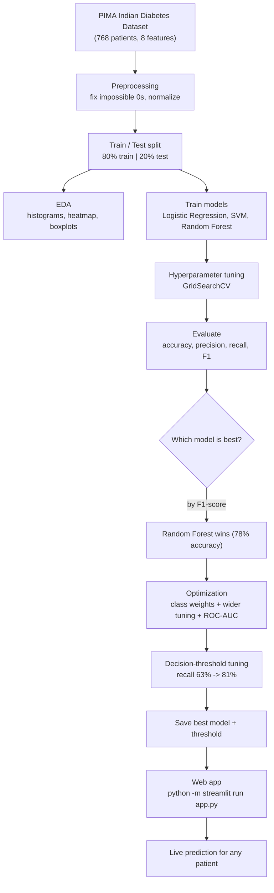

# Diabetes Prediction — an AI helper that tells you your risk

> 🚀 **Try it live:** [diabetes-prediction-v0.streamlit.app](https://diabetes-prediction-v0.streamlit.app)
> No sign-up, no install — just open it.
> Want to run your own copy? [Deploy from this repo](https://share.streamlit.io/deploy?repo=https://github.com/sam-black007/diabetes-prediction) (free Streamlit Cloud, one click).


This is a small, friendly web app that estimates **your risk of diabetes** from a few health numbers —
or, if you don't have those numbers, from simple lifestyle questions. It's built with machine learning
(trained on the classic **PIMA Indian Diabetes Dataset** of 768 patients) and a free AI assistant that
explains the results in plain language.

Think of it as an early-warning screen, not a doctor. It's here to help you notice risk early and
decide whether it's worth talking to a professional.

---

## What's inside

Four tabs, each doing one job well:

- **🩺 Medical Report** — snap a photo or drop in a PDF of a blood-test report. The app reads it
  (OCR), pulls out the numbers, and gives you a risk result you can tweak and re-run.
- **💬 Guided Intake** — don't have a report? A conversational assistant asks you questions. If you
  *do* have recent test values, it collects them and predicts. If you *don't*, it gently switches to a
  **no-blood-test lifestyle check** (the validated FINDRISC questionnaire) and estimates your 10-year risk.
- **📊 Model Analytics** — the behind-the-scenes view: how the models compare, ROC curves, which
  factors matter most, and a confusion matrix.
- **🤖 AI Clinical Assistant** — chat with a free LLM (Qwen) about your result, ask "what does this
  mean?", or let it pull fresh, practical prevention tips from the web.

Everything runs in your browser; a trained model ships with the project, so it works the moment you open it.

---

## Run it on your own computer

### 1. Install Python (skip if you already have it)
Download from [python.org](https://www.python.org/downloads/) (3.10 or newer). **Tick "Add Python to PATH"**
during install — that step saves you pain later. Check it worked:

```bash
python --version
# you should see something like: Python 3.11.9
```

### 2. Get the project
```bash
git clone https://github.com/sam-black007/diabetes-prediction
cd diabetes-prediction
```
No Git? Click **Code → Download ZIP** on the repo page, unzip, and open a terminal in that folder.

### 3. Install the libraries
```bash
pip install -r requirements.txt
```
You'll see a flurry of "Downloading / Successfully installed" lines. This pulls in
Pandas, NumPy, Scikit-Learn, Matplotlib, Seaborn, and Streamlit.

### 4. Launch the app
```bash
python -m streamlit run app.py
```
(On Windows, if `python` isn't found, try `py -m streamlit run app.py`.) It opens
**http://localhost:8501** automatically. Stop it anytime with `Ctrl + C`.

---

## How it was built (the short version)



If you want to run the whole pipeline yourself — raw data to live app — do it in this order:

```bash
python src/01_preprocessing.py   # 1. clean + normalize + split
python src/02_eda.py             # 2. generate the charts
python src/03_model_training.py  # 3. train + tune + compare models
python src/04_optimization.py    # 4. optimize + save the best model
python -m streamlit run app.py   # 5. open the web app
```

What each step does:
1. **`01_preprocessing.py`** — loads the raw data, fixes impossible `0` values (a person can't have
   0 glucose or 0 BMI — those are really "missing"), normalizes the features, and splits 80/20.
2. **`02_eda.py`** — draws the charts and saves them to `plots/`.
3. **`03_model_training.py`** — trains and tunes Logistic Regression, SVM, and Random Forest, then
   saves the best one as `best_model.joblib`.
4. **`04_optimization.py`** — handles the class imbalance, tries more models, tunes the decision
   threshold, and saves the final model + `model_threshold.json`.
5. **`app.py`** — the web app, using that saved model.

**Want a sanity check?** Run `python tests/test_project.py` afterwards — it runs a set of automated
checks (files present, data splits correct, model beats the baseline) and tells you if anything's off.

---

## The results, in plain English

We started with three models. Random Forest was best at first (~78% accurate). But the dataset is
**unbalanced** — far more non-diabetic patients than diabetic — so a model can look "accurate" while
missing the people who actually have diabetes. To fix that we optimized for *recall* (catching real
cases) and tuned the decision threshold.

**Before optimization:**

| Model | Accuracy | Precision | Recall | F1-Score |
|-------|----------|-----------|--------|----------|
| Logistic Regression | 0.708 | 0.600 | 0.500 | 0.546 |
| SVM (tuned) | 0.740 | 0.652 | 0.556 | 0.600 |
| Random Forest (tuned) | 0.779 | 0.717 | 0.611 | 0.660 |

**After optimization:**

| Model | Accuracy | Recall | F1-Score | ROC-AUC |
|-------|----------|--------|----------|---------|
| Random Forest (tuned + balanced) | 0.773 | 0.704 | 0.685 | 0.834 |
| Random Forest + threshold tuning | 0.760 | 0.722 | 0.678 | 0.834 |
| XGBoost + threshold tuning | 0.734 | 0.852 | 0.692 | 0.831 |
| XGBoost + SMOTE + threshold tuning | 0.734 | 0.833 | 0.687 | 0.827 |
| Stacking ensemble + threshold tuning | 0.747 | 0.796 | 0.688 | 0.823 |
| **Gradient Boosting + threshold tuning** | **0.766** | **0.815** | **0.710** | **0.823** |

In the end **Gradient Boosting** won, with a tuned threshold of **0.31**. The big win: it now catches
**81% of diabetic patients**, up from 63% — meaning far fewer real cases slip through. (PIMA tops out
around 78% accuracy, so the next leap would need a bigger, richer dataset.)

## How accurate is it, really?

These aren't estimates — they're computed by running the final model on the **154-patient test set**
(54 of them actually diabetic) at our threshold of 0.31:

| Metric | Score | What it means |
|--------|-------|---------------|
| Accuracy | 76.6% | overall correct calls |
| Sensitivity (recall) | 81.5% | of people who truly have diabetes, we caught 81.5% |
| Specificity | 74.0% | of people who *don't*, we correctly cleared 74% |
| Precision (PPV) | 62.9% | when we say "diabetes likely", ~63% truly have it |
| NPV | 88.1% | when we say "no diabetes", ~88% truly don't |
| ROC-AUC | 0.823 | overall separation skill (0.5 = random) |

Confusion matrix: **44 true positives, 10 missed, 26 false alarms, 74 true negatives.**

Read it the way a clinician would: this is a **screening** tool, not a diagnosis. It's deliberately
tuned to catch as many real cases as possible (high sensitivity), which means it will occasionally flag
someone who turns out fine (lower specificity). That is exactly the trade-off the **WHO** and **IDF**
accept for population screening — a positive result is meant to trigger a proper confirmatory test
(fasting glucose / HbA1c), not replace one.

For perspective, the validated **FINDRISC** questionnaire — the same one our no-lab flow uses — reports
an AUC of ~0.85 for 10-year type 2 diabetes risk in published studies. Our model's ROC-AUC of **0.82**
sits in that same screening-instrument range, which is reassuring: the signal the data learns is
consistent with established medical risk scoring.

> ⚠️ These scores are on the historical PIMA set, which is small and demographic-specific. Real-world
> accuracy on a different population will vary, so always confirm with a professional.

---

## Charts

**How the models compare**


**Confusion matrix (tuned Random Forest)**


**Correlation between features**


**ROC curves of the optimized models**


**What drives the prediction (feature importance)**


**Glucose vs BMI**


**Diabetes rate by age group**


---

## Project structure

```
data/
  diabetes.csv              raw dataset
  sample_report.pdf         example lab report (try it in the Medical Report tab)
  sample_report.png         example report photo
  sample_patients.csv       example spreadsheet (legacy sample data)
  processed/                cleaned data, train/test sets, trained model + threshold
plots/                      all the charts
src/
  01_preprocessing.py       clean + normalize + split
  02_eda.py                 charts
  03_model_training.py      train + compare the 3 models
  04_optimization.py        optimize and save the final model
  report_parser.py          reads lab report PDFs / images
  ai_agents.py              AI assistant (chat, enrichment, web research)
  risk_questionnaire.py     FINDRISC lifestyle risk score
app.py                      the web app
tests/
  test_project.py           automated sanity checks
requirements.txt
README.md
```

---

## A note on accuracy & safety

This tool is for **screening and education only** — it is **not a medical diagnosis**. The model is
trained on a limited historical dataset, so results can be wrong, especially for groups underrepresented
in that data. If a result worries you, or you have symptoms, please see a qualified clinician. The AI
chat replies are general guidance, not personalized medical advice.

---

## Backed by the world's health authorities

Our model is trained on the PIMA dataset, but the **risk factors it learns line up with what the
leading health bodies say drives type 2 diabetes**. The app also uses the standard diagnostic glucose
cut-offs and the FINDRISC questionnaire — a validated tool used in WHO/IDF prevention programmes.

Where our approach matches the official guidance:
- **Glucose thresholds** — we flag diabetes at an after-meal glucose **≥ 200 mg/dL**, matching the
  WHO/ADA criterion of 2-hour post-load glucose ≥ 11.1 mmol/L (200 mg/dL); fasting ≥ 126 mg/dL is the
  equivalent fasting standard.
- **Key risk factors** — glucose, BMI, age, blood pressure, and family history are exactly the factors
  WHO, CDC, and the IDF call out.
- **Lifestyle screening** — the no-blood-test flow uses **FINDRISC**, the validated Finnish
  questionnaire adopted by IDF/WHO prevention programmes.

Authoritative sources we cite and learn from:
- **World Health Organization (WHO)** — [Diabetes fact sheet](https://www.who.int/news-room/fact-sheets/detail/diabetes) · [Diabetes health topic](https://www.who.int/health-topics/diabetes)
- **US CDC** — [Diabetes](https://www.cdc.gov/diabetes/)
- **US NIH / NIDDK** — [Diabetes health information](https://www.niddk.nih.gov/health-information/diabetes)
- **International Diabetes Federation (IDF)** — [idf.org](https://idf.org/) · [Diabetes Atlas](https://diabetesatlas.org/)
- **American Diabetes Association** — [diabetes.org](https://diabetes.org/)
- **Mayo Clinic** — [Diabetes overview](https://www.mayoclinic.org/diseases-conditions/diabetes/symptoms-causes/syc-20371444)
- **UK NHS** — [Diabetes](https://www.nhs.uk/conditions/diabetes/)

The in-app **AI Clinical Assistant** now searches these organizations first and cites them in its
answers, so the advice you get is grounded in the latest official guidance rather than guesswork.

---

## License

Released under the **MIT License** — free for anyone to use, modify, and share.
See [LICENSE](LICENSE). Built openly so anyone can learn from it or run their own version.
